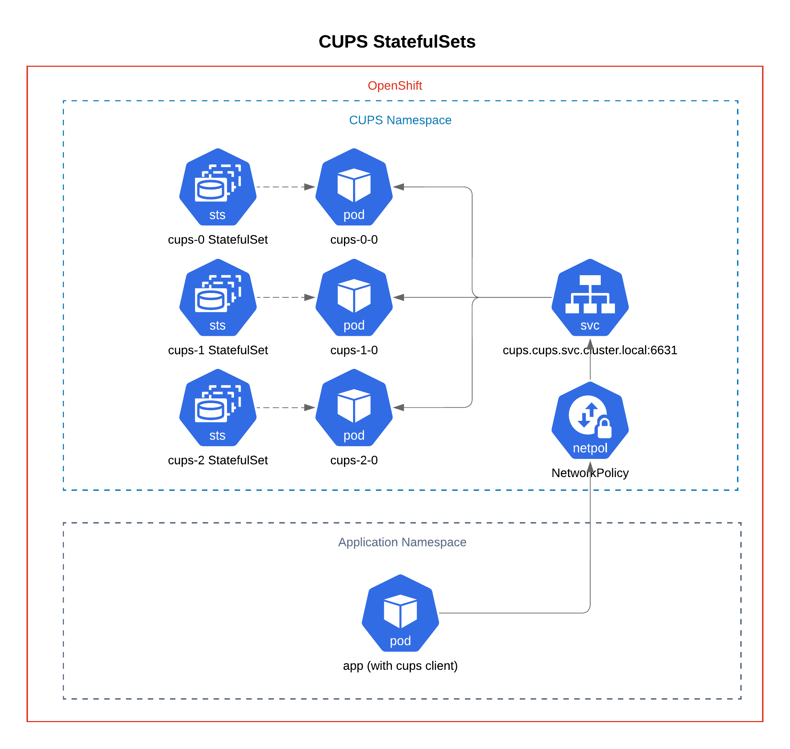

# cups

Deploy [CUPS](https://en.wikipedia.org/wiki/CUPS) StatefulSets on Openshift.



> Note: this is to test running the registry.redhat.io/rhel9/cups:latest image.

```sh
helm upgrade -i cups helm/cups -n cups --create-namespace \
  --set-file=config.cupsd=examples/cupsd.conf \
  --set-file=config.printers=examples/printers.conf
```

expose with route (for testing)...

```sh
export INGRESS_DOMAIN=$(oc get ingress.config.openshift.io cluster -o jsonpath={.spec.domain})
helm upgrade -i cups helm/cups -n cups --create-namespace \
  -f helm/cups/values-expose.yaml \
  --set ingress.hosts[0].host=cups-cups.${INGRESS_DOMAIN} \
  --set-file=config.cupsd=examples/cupsd.conf \
  --set-file=config.printers=examples/printers.conf
```

or...

```sh
oc port-forward $(oc get pods -n cups -o name) -n cups 6631:6631
```

## Network Policies 
Network policies are defined in `/helm/cups/templates/networkpolicies.yaml`. Remove or add rules to the file to make less or more restrictive network policies. Network policies are additive and configured using pod labels and namespace labels. See OpenShift documentaiton for more details: https://docs.openshift.com/container-platform/4.10/networking/network_policy/about-network-policy.html. 

## Rollout New Pods when ConfigMap Updates

Adding annotation `checksum/config: {{ include (print $.Template.BasePath "/configmap-cups-conf.yaml") $ | sha256sum }}` to the StatefulSet to allow `helm upgrade` to detect a change to the StatefulSet whenever there is a change to `config-cups-conf.yaml` and roll out new pods.  This way new pods will be running with the new configurations.


# cups-client
Deploy cups-client on OpenShift

```sh

helm upgrade -i client helm/cups-client -n cups --create-namespace \
  --set-file=config.client=examples/client.conf

```

## build & publish

```sh
export IMG_REGISTRY= # quay.io/trevorbox/cups
podman build -t ${IMG_REGISTRY}:latest .
# run locally...
podman run -it --rm --entrypoint "/bin/bash" ${IMG_REGISTRY}:latest
podman push ${IMG_REGISTRY}:latest
```

test published image...

```sh
helm upgrade -i cups helm/cups -n cups --create-namespace \
  --set image.repository=${IMG_REGISTRY} \
  --set-file=config.cupsd=examples/cupsd.conf \
  --set-file=config.printers=examples/printers.conf
```

## CUPS Printer Drivers and Configurations.

A typical CUPS install provides printer drivers dynamically by using a driver information file (.drv) and creating a PPD driver file that can be used by CUPS printers. By default, when a printer is configured in CUPS, the PPD driver is saved to the /etc/cups/ppd/ directory, and the printer definition is added to the /etc/cups/printers.conf file. The printers.conf file can hold information for more than one printer and required PPD files can be added to the /etc/cups/ppd/ directory.

If the printer configurations (/etc/cups/printers.conf) and drivers (/etc/cups/ppd/) that are required are known these can be included in builds.

## Sending Test Print Jobs

To test printing from the command line, you can use the lp command which is provided from the cups-client.rpm
To send a test print job from the command line of a client:
```sh
echo "Test Message Content" | lp -d printer_name
```
Or,
```sh
lp -d printer_name /path/to/file
```

Cups provides test files in the /usr/share/cups/data/ directory.
You can add a different job name by using the -t (title) option with a messages:
```sh
lp -d printer_name -t "Print Job XYZ" /usr/share/cups/data/default-testpage.pdf
```

Finally, from the CUPS UI, select a printer and then in the Maintenance drop down list select "Print Test Page"